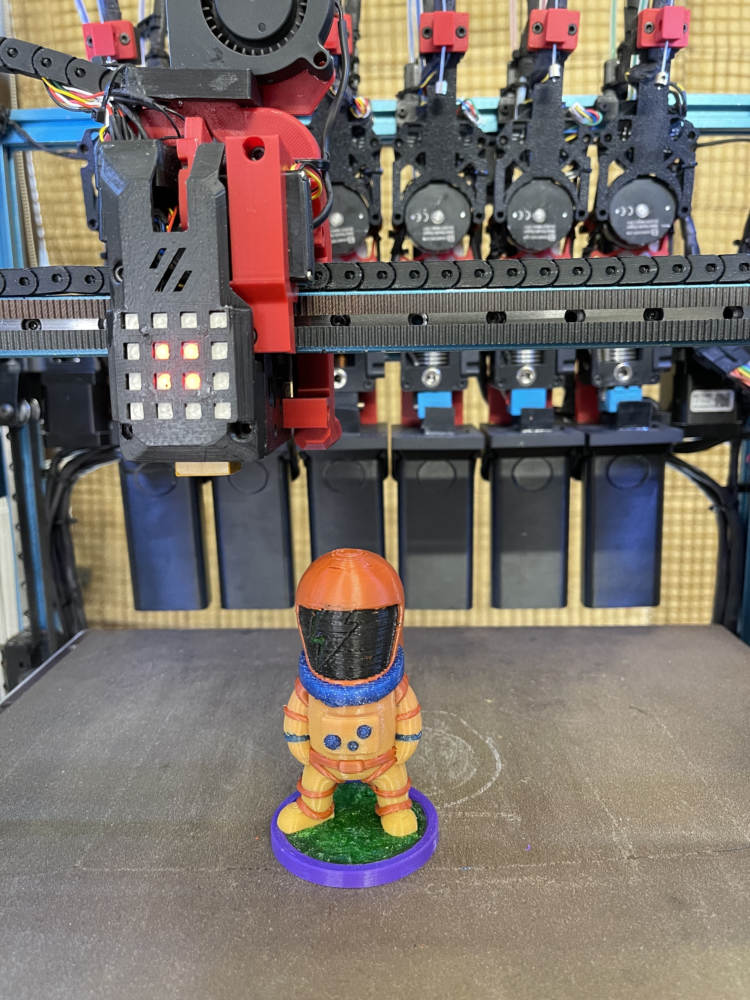
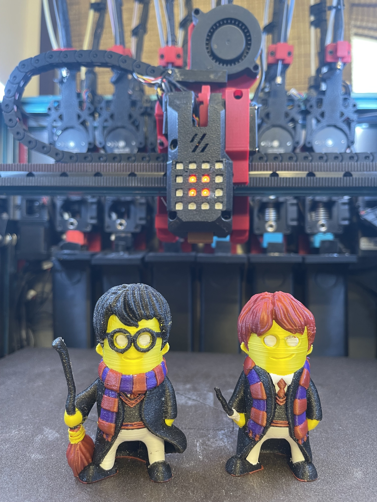
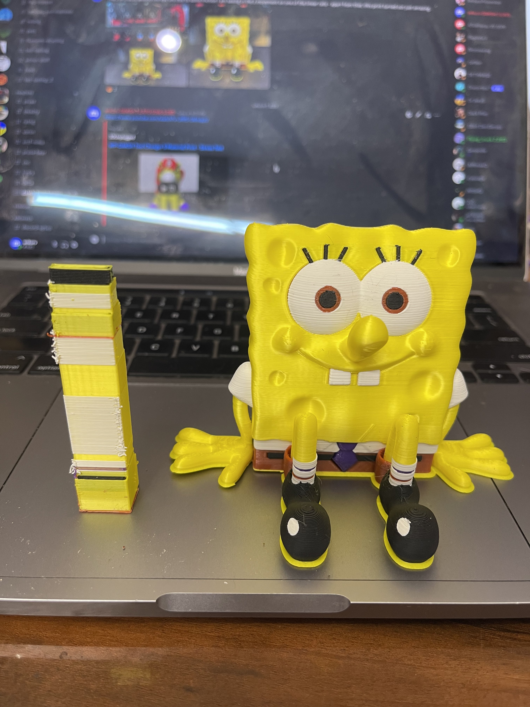
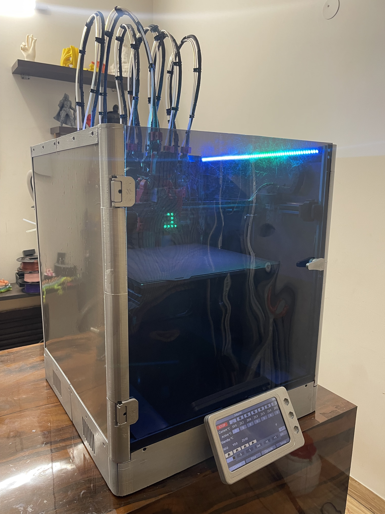
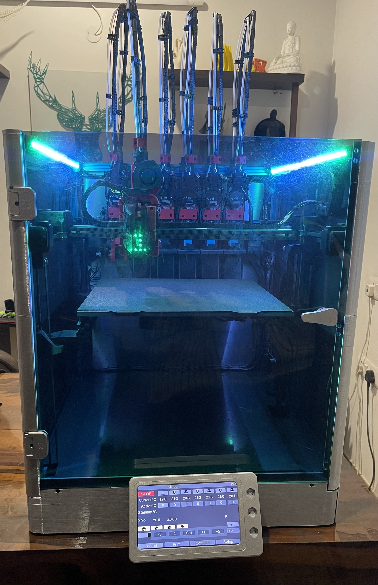
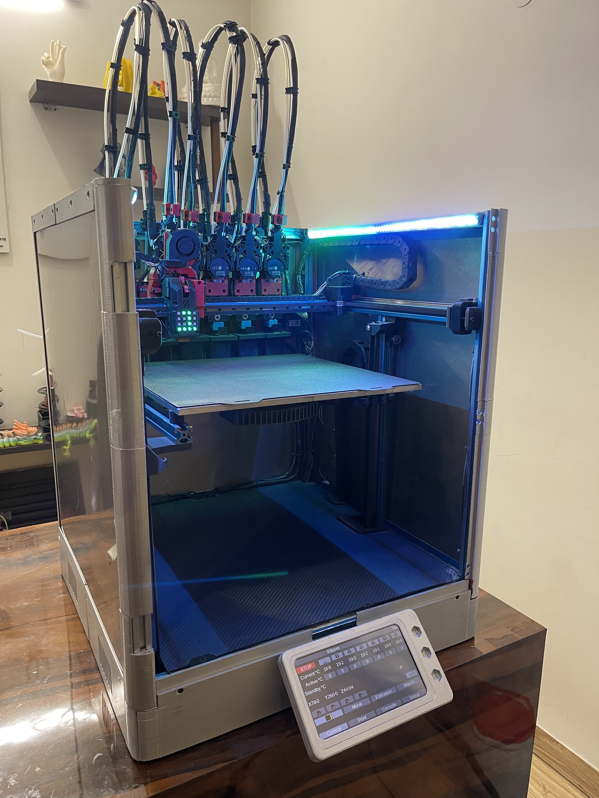
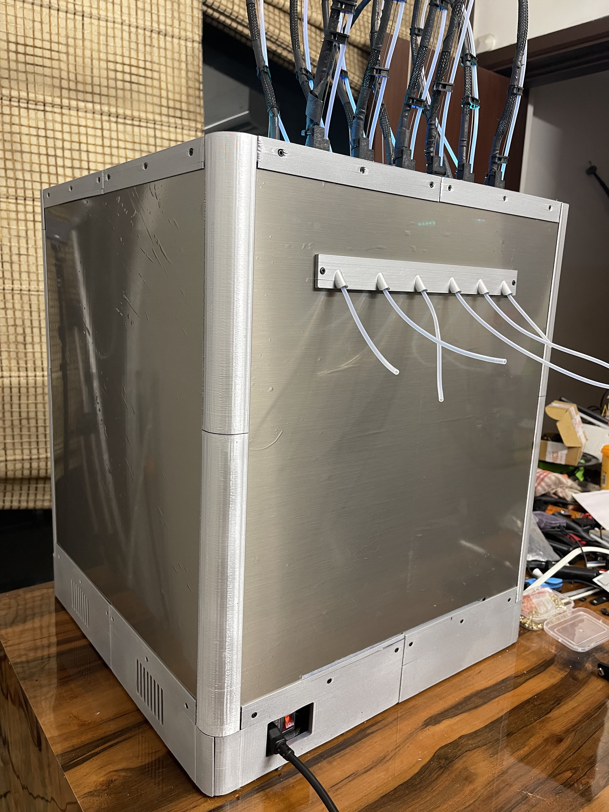
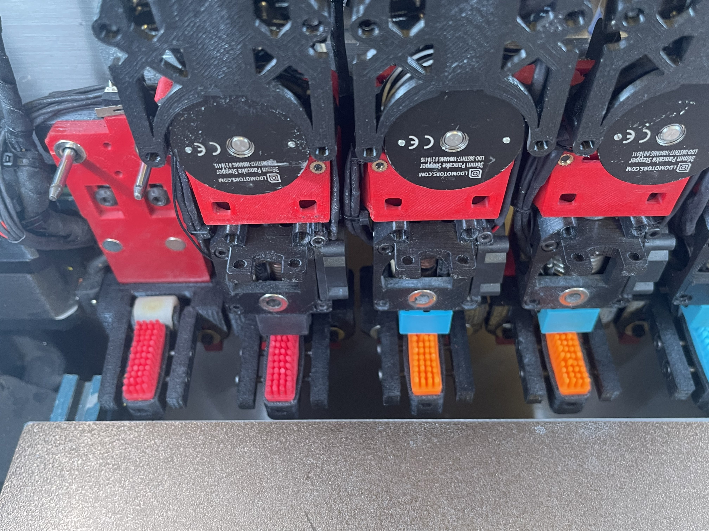

# WP-DAKSH 3D Printed Tool Changer

'WP-DAKSH' 3D Printed Tool Changer is a fully 3D printed tool changer compatible  with different CoreXY platforms like the Voron Trident, 1.8, 2.4  and RatRig VCore 3. 

It features state of the art advanced features including: 

  * Reliable tool changing mechanism powered by a single servo
  * Servo Burnout protection for enhanced life and efficient tool changes
  * Intelligent Error State Detection and Recovery minimizing failed prints
  * Automatic XYZ calibration across the different tools
  * Ultra Fast tool changing times of approx. 10 seconds - including nozzle cleaning and priming.
  * Capable of High accelerations and print speeds
  * Minimal loss in build space with the tool changer addition
  * Integrated nozzle cleaning mechanism for clean prints without the need for a purge tower / ooze shield
  * 4x4 LED Display on toolhead to display the current state of toolhead
  * Custom Klipper configuration, modules and macros for an integrated software package
  * Stiff Wire Looms and recoil management like Prusa XL - wire looms are entirely contained within the printer frame itself.
  *  Fully Enclosed Design in the same design ethos as the original Voron Trident design - giving it the ability to print high temp materials like ABS, PA6-CF and PC-CF etc which require enclosed chambers.

The design is open source and can be used freely for non commercial purposes. Do join the discord group at the link below and subscribe to the Youtube channel for more updates and interesting projects like this.

* Github - https://github.com/ankurv2k6/wp-daksh-toolchanger
* WP-Daksh Discord - https://discord.gg/Kz9VC8rWPg
* Initial BOM - https://docs.google.com/spreadsheets/d/12ISdJoCqgUTPsUwRrQ3VZWM-GBWw20C0cgHo7VGqMWU

IMPORTANT INFO

Supports Needed for the following parts:

* Tools - STL/tools/v6/v6_front.stl, STL/tools/dragon/dragon_front.stl
* Dock -  STL/dock/dock_mount_left.stl, STL/dock/dock_mount_right.stl, STL/dock/dock_mount_middle.stl

Intelligent Error State Detection and Recovery Demo - https://www.youtube.com/watch?v=iPQEkaGzjxA&t=93s

Automatic XYZ Multi Tool Calibration Demo - https://www.youtube.com/watch?v=ppcTm3NfDo0

Sample Prints

Build Images

Build Log and Demo videos 

https://www.youtube.com/channel/UCr8K1tva2CaEhyqNyaEjq_w

* Part 1 - Design Overview, Locking Mechanism & Multi Platform Compatibility
* Part 2 - Frame Overview & Carriage Assembly with Tool Locking Mechanism
* Part 3 - Assembling a tool - Dragon and V6 Hotend
* Part 4 - Putting it all together - carriage, tool, dock and their alignment 
* Part 5 - Wiring Overview - wire looms & ptfe management
* Part 6 - Electronics and Wiring management
* Part 7 - Software Setup & Initial Configuration
* Part 8 - Printing in multi material with the tool changer.
